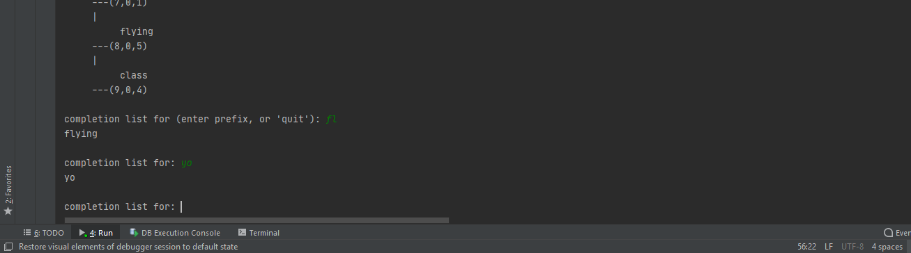
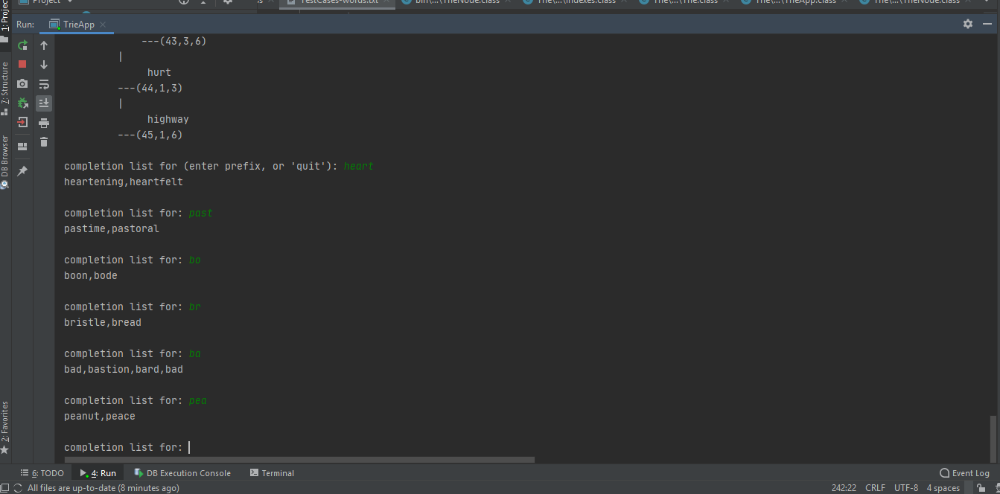
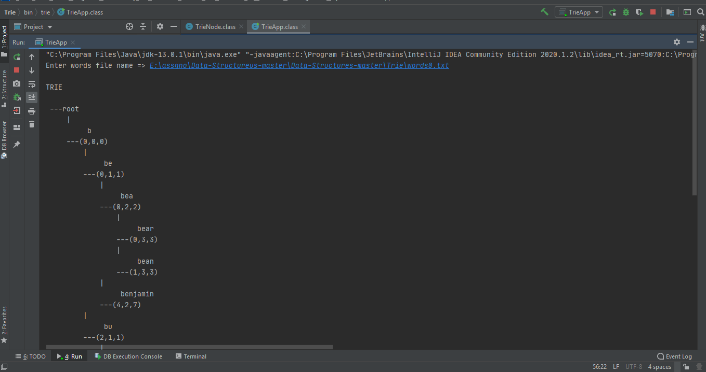

# Trie-Tree-Implementation
 Word  prefix trie-tree implementation

The repository contains a basic implementation of search using Tries (Prefix Trees).
#Trie Structure 

A Trie is a general tree, in that each node can have any number of children. It is used to store a dictionary (list) of words that can be searched on, in a manner that allows for efficient generation of completion lists. 
The word list is originally stored in an array, and the trie is built off of this array. Here are some examples of word lists and the tries built to store the words, followed by an explanation of the trie structure and its relationship to its source word list. Trie 1 
Root node is always empty. Child [0,0,3] of root stores "data" in a 
triplet 0 (for index of word in list), 0 (for position of first character, 'd' in "data") and 3 (for position of last character, 'a') 

Trie 2 
Child (0,0,0) of root stores common prefix "d" of its children "data" (left child) and "door" (right child), in triplet 0 (index of first word "data" in list), 0 (starting position of prefix "d"), and 0 (ending position of prefix "d"). Internal nodes represent prefixes, leaf nodes represent complete words. The left leaf node stores triplet 0 (first word in list), 1 (first index past the common prefix "d", and 3 (last index in word). The right leaf node is stored similarly. 
Trie 3 
Like in trie 2, child of root stores common prefix "d", but this time left child is "door", and right child is "data", because "door" appears before "data" in the array. 

Trie 4 
A node stores the longest common prefix among its children. Since "do" is the longest common prefix of all the words in the list, it is stored in the child of the root node as the triplet (0,0,1). The left branch points to a subtree that stores "door" and "doom" since they share a common prefix "doo", while the right branch terminates in the leaf node for "dorm" stored as the triplet 1 (index of word "dorm"), 2 (starting position of substring "rm" following prefix "do"), and 3 (ending position of substring “rm") 

Trie 5 
 
There is no common prefix in "door" and "poor", so the root has 2 children, one for each word. (Common suffixes are irrelevant) 

Trie 6 
 
There is no common prefix among all the words. But "door" and "doom" have a common prefix "doo", while "pore" and "port" have a common prefix "por". 
Trie 7 
cat	muscle	pottery	possible	possum	musk	potato	muse
0	1	2	3	4	5	6	7
  

#Special Notes 
•	Every leaf node represents a complete word, and every complete word is represented by some leaf node. (In other words, internal nodes do not represent complete words, only proper prefixes.) 
•	No node, except for the root, can have a single child. In other words, every internal node has at least 2 children. Why? Because an internal node is a common prefix of several words. Consider these trees, in each of which an internal node has a single child (incorrect), and the equivalent correct tree: 

One-word trie Incorrect/Correct  	 	 	Two-word trie Incorrect/Correct 
 
•	A trie does NOT accept two words where one entire word is a prefix of the other, such as "free" and “freedom". (You will not come across this situation in any of the test cases for your implementation.) 
•	The process to build the tree (described in the Building a Trie section below), will create a single child of the root for the longest common prefix "free", and this node will have a single child, a leaf node for the word "freedom". But this is an incorrect tree because it will (a) violate the constraint that no node aside from the root can have a single child, and (b) violate the requirement that every complete word be a leaf node (the complete word "free" is not a leaf node). 
  	 	 	  
On the other hand, a tree with two leaf node children off the root node, one for the word "free" and the other for the word "freedom" will be incorrect because the longest common prefix MUST be a separate node. (This is the basis of completion choices when the user starts typing a word.) 

#Data Structure 

Since the nodes in a trie have varying numbers of children, the structure is built using linked lists in which each node has three fields: • substring (which is a triplet of indexes) 
• first child, and 
• sibling, which is a pointer to the next sibling. 
Here's a trie and the corresponding data structure: 
 	  	 	 	 	Data Structure 
                   
#Building a Trie 

A trie is built for a given list of words that is stored in array. The word list is input to the trie building algorithm. The trie starts out empty, inserting one word at a time. 
Example 1 
The following sequence shows the building of the above trie, one word at a time, with the complete data structure shown after each word is inserted. 
Input and Initial Empty Tree 
  
An empty trie has a single  root node with null for all the fields. 
 
 
After Inserting "dorm" 
  
When "dorm" is inserted, its prefix “do" is found to match with prefix "do" in  the existing word "door". So the third  value in the triplet for the existing node  is changed from 3 to 1, corresponding to  the prefix "do". (The word index--first  value in triplet--is left unchanged.)  And two new nodes are made at the next  level for the two trailing substrings, "or" of "door" and "rm" of "dorm" - The array  indexes of these words are in ascending  order, i.e. "door" MUST come before  “dorm” in the node sequence. 

Example 2 

This shows the sequence of inserts in building Trie 7 shown earlier. 
 
 
 
#Prefix Search
 
Once the trie is set up for a list of words, you can compute word completions efficiently. 
For instance, in the trie of Example 2 above (cat, muscle, ...),suppose you wanted to find all words that started with "po" (prefix). The search would start at the root, and touch the nodes [0,0,2],(1,0,2),(2,0,1),(2,2,2),(3,2,3),[2,3,6],[6,3,5],[3,4,7],[4,4,5]. The nodes [2,3,6],[6,3,5], [3,4,7],[4,4,5] are the ones that hold words that begin with the given prefix. 

For a detailed guide on how to build Tries, refer to the following post: https://medium.com/@amogh.avadhani/how-to-build-a-trie-tree-in-java-9d144aaa0d01
